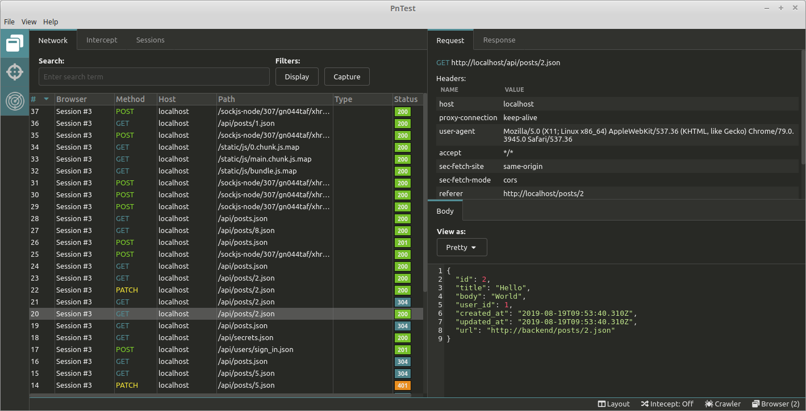

# OneProxy

An HTTP proxy application for performing penetration tests against web applications, with advanced capabilities for handling single-page-applications. This project is no longer in development. Instead it is now being developed as a native gui application using Qt and C++.



## Install

First, clone the repo via git:

```bash
git clone --depth 1 https://github.com/evanrolfe/puppetmaster
```

And then install the dependencies with yarn.

```bash
$ cd your-project-name
$ ELECTRON_BUILDER_ALLOW_UNRESOLVED_DEPENDENCIES=true yarn install
```

## Develop

To run the app in development mode, you need to start three seperate processes:

1. Start the electron app in the `dev` environment.

```bash
$ yarn dev
```

2. Start the backend:

```bash
$ NODE_ENV=development yarn start-backend
```

3. Start the proxy:

```bash
$ NODE_ENV=development yarn start-proxy
```

## Test

```bash
$ yarn test
```

## Debug

To debug the backend, you can start the backend with a debugger attached using vscode.
Go VSCode => Debug, then start launch "Backend [DEVELOPMENT]".

To debug the backend from a test, in VSCode debugger, launch "Backend [TEST]",
then run the test with the `--no-backend` or `-nb` option:

```bash
$ yarn test -nb
```

## Run in production mode

Build:

```bash
$ yarn build
```

This will compile files to ./dist folder. Then:

```bash
$ yarn start-prod
```

## Package

To package apps for all platforms:

```bash
$ yarn package-all
```

Which create packages in the ./release folder.
